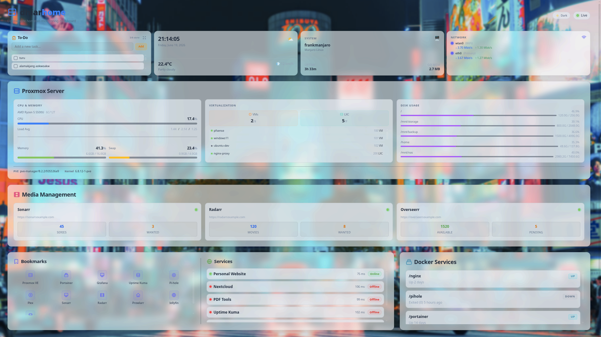
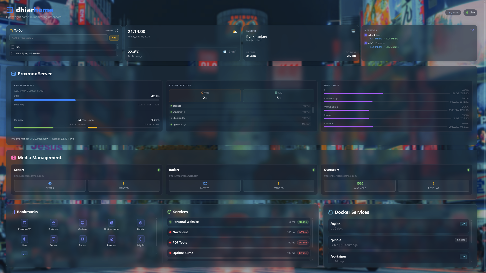

# dhiarhome — Demo Branch

> **This is the demo branch.** It is not intended for deployment or production use. All data is mock/cosmetic — no real API calls are made. For the full-featured production version, see the `main` branch.

A lightweight homelab monitoring dashboard showcasing Proxmox VE, Docker containers, web services, media services, and network monitoring — all rendered with a glassmorphism UI. Built with Go, HTMX, Alpine.js, and Tailwind CSS.

| Dark Mode | Light Mode |
|-----------|-----------|
|  |  |

---

## What This Demo Showcases

Everything runs on **mock data** — no Proxmox server, Docker daemon, or external APIs needed:

- **Proxmox VE** — CPU, RAM, multi-disk usage, CPU info, VM/LXC status
- **Docker containers** — status with interactive toggle (Up/Down)
- **Web services** — uptime with response times and interactive toggle (Online/Offline)
- **Media services** — Sonarr/Radarr/Overseerr stats (mock)
- **Bookmarks** — custom links with auto-fetched favicons
- **Network interfaces** — simulated RX/TX speeds
- **To-do list** — interactive Alpine.js widget (persisted to JSON)
- **Weather + time** — combined card with live clock and mock weather
- **System info** — hostname, OS, uptime, Go runtime stats
- **Glassmorphism UI** — transparent cards, custom backgrounds, dark/light theme toggle
- **Toast notifications** — popup alerts on service/container toggle
- **Auto-refreshing** — HTMX 5s polling with custom DOM-diff (no backdrop-filter flicker)

---

## Tech Stack

- **Backend:** Go 1.26 (statically compiled, single binary)
- **Frontend:** HTML5 + Tailwind CSS + HTMX 1.9.10 + Alpine.js 3.x
- **Config:** YAML

---

## Quick Start

```bash
# Clone the repository (demo branch)
git clone -b demo https://github.com/Alfar0nt/dhiarhome.git
cd dhiarhome

# Run directly
go run .

# Or build and run
go build -o dhiarhome .
./dhiarhome
```

Open `http://localhost:8080` in your browser. That's it — no Docker, no API credentials, no setup needed.

### Command-line flags

```bash
./dhiarhome --config myconfig.yaml   # Custom config path (default: config.yaml)
./dhiarhome --addr :9090             # Custom listen address (default: :8080)
```

---

## Configuration

All customization is in `config.yaml`. The included config is pre-configured for the demo — edit it to change services, bookmarks, widgets, or appearance.

### Services (mock-monitored)
```yaml
services:
  - name: "Personal Website"
    url: "https://example.com"
  - name: "Nextcloud"
    url: "https://nextcloud.example.com"
```

### Appearance
```yaml
appearance:
  theme: "dark"              # "dark" or "light"
  accent_color: "#3b82f6"    # Accent color hex
  card_opacity: 0.6          # Card background opacity
  card_blur: 12              # Card backdrop blur (px)
```

### Widgets
```yaml
widgets:
  weather:
    enabled: true
    units: "celsius"          # "celsius" or "fahrenheit"
  datetime:
    enabled: true
    timezone: "Asia/Jakarta"
    format_24h: true
  system_info:
    enabled: true
```

### Network (mock)
```yaml
network:
  enabled: true
  show_speed: true
  show_total_transfer: true
  interfaces:
    - name: "eth0"
      label: "Primary"
```

---

## Interactive Demo Features

### Service & Container Toggles

Each monitored service and Docker container has a **refresh icon button** that toggles its status:
- Services: Online ↔ Offline
- Containers: Up ↔ Down

Toggled states persist in memory via server-side override maps. Toast notifications appear in the top-right corner showing the transition (e.g., "nginx (container): running → exited · 14:32:10"). Overrides are cleared on server restart.

### Info Panels

Each widget section has an **info button** (ⓘ) that reveals a description. The header's **"What am I looking at?"** button opens/closes all info panels simultaneously.

### To-Do List

Interactive Alpine.js widget — check/uncheck items to toggle completion. Adding and deleting are disabled in demo mode. A full-screen modal is available via the expand button.

---

## Documentation

Full documentation is available in [documentation/docs.md](documentation/docs.md).

---

## Project Structure

```
dhiarhome/
├── main.go                      # Application entry point
├── config.yaml                  # Demo configuration
├── internal/
│   ├── bookmarks/               # Bookmark processing + favicon cache
│   ├── cache/                   # Service state cache (linked list)
│   ├── config/                  # YAML configuration loader
│   ├── docker/                  # Docker mock data
│   ├── mediaservices/           # Media services mock data
│   ├── network/                 # Network mock monitor
│   ├── proxmox/                 # Proxmox mock data + types
│   ├── todo/                    # Persistent to-do store
│   └── widgets/                 # Weather, datetime, sysinfo, custom_text
├── static/
│   └── index.html               # Dashboard page (Go template + HTMX)
├── templates/
│   ├── status.html              # Status template
│   ├── mediaservices.html       # Media services card
│   ├── todo.html                # To-do widget (Alpine.js)
│   ├── network.html             # Network card
│   └── bookmarks.html           # Bookmarks card
└── documentation/
    └── docs.md                  # Project documentation
```

---

## Why This Project?

Home servers often have limited resources. Many existing dashboards are heavy and require databases or complex setups. dhiarhome provides:

- **Zero database** — all data in-memory
- **Minimal resources** — ~10-20MB RAM, <1% CPU
- **Single binary** — ~15MB, no dependencies
- **Easy customization** — edit YAML, not code

---

## License

This project is licensed under the [MIT License](LICENSE).

Copyright (c) 2026 Dhiar Harianto
