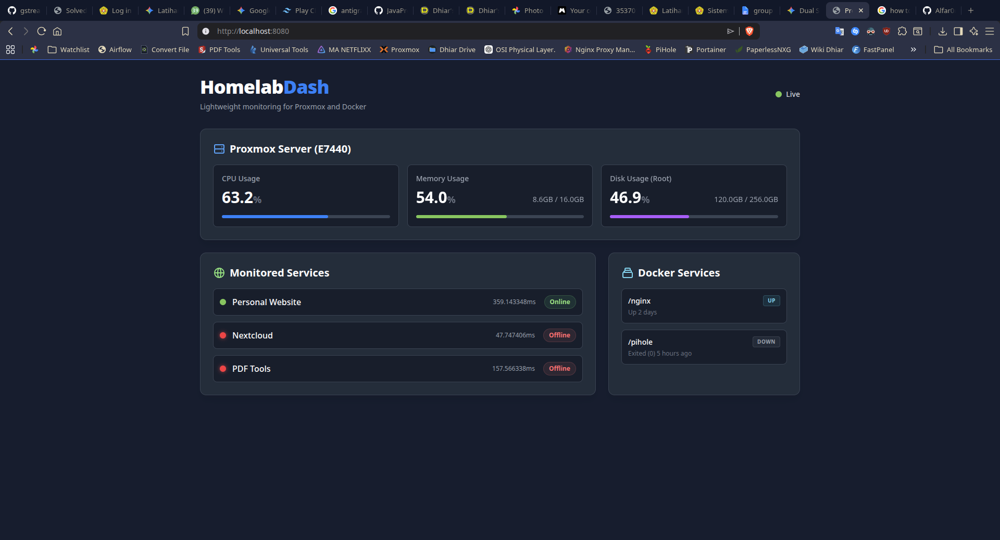

# Selfhosted Proxmox Dashboard

A simple, ultra-lightweight web dashboard for monitoring your homelab server running Proxmox VE. Track server health, Docker containers, and web service uptime—all from one beautiful dark-mode interface.



---

## What is this?

This is my personal learning project for homelab monitoring. It's a lightweight dashboard designed for resource-constrained home servers (like a Dell Latitude running Proxmox). Instead of heavy dashboards that require databases or complex setups, this gives you a fast, beautiful monitoring page that uses almost zero resources.

**Key Features:**
- Real-time Proxmox server metrics (CPU, RAM, disk usage)
- Docker container status monitoring
- Web service uptime checks with response times
- Auto-refreshing dashboard (no manual reload needed)
- Mock mode for testing without real credentials
- Single binary deployment (~10MB)

---

## Tech Stack

- **Backend:** Go (Golang) - Statically compiled, ultra-fast, tiny binary
- **Frontend:** HTML + Tailwind CSS - Beautiful dark-mode design
- **Interactivity:** HTMX - Auto-updates without JavaScript complexity
- **Deployment:** Docker - Multi-stage build for minimal image size

---

## Quick Start

### Option 1: Docker (Easiest)

```bash
# Clone the repository
git clone https://github.com/Alfar0nt/SelfHosted-Proxmox-Dashboard.git
cd SelfHosted-Proxmox-Dashboard

# Create your config file
cp config-example.yaml config.yaml
nano config.yaml  # Edit with your settings

# Build and run
docker build -t homelab-dash .
docker run -d \
  -p 8080:8080 \
  -v $(pwd)/config.yaml:/app/config.yaml \
  -v /var/run/docker.sock:/var/run/docker.sock:ro \
  homelab-dash
```

Open `http://localhost:8080` in your browser.

### Option 2: Build from Source

```bash
# Install Go from https://go.dev/
# Clone and build
git clone https://github.com/Alfar0nt/SelfHosted-Proxmox-Dashboard.git
cd SelfHosted-Proxmox-Dashboard
cp config-example.yaml config.yaml
go build -o dashboard main.go
./dashboard
```

For detailed deployment instructions, see [documentation/deployment.md](documentation/deployment.md).

---

## Configuration

All customization happens in `config.yaml`—no code changes needed!

### 1. Copy the example config
```bash
cp config-example.yaml config.yaml
```

### 2. Edit your settings

**Add websites to monitor:**
```yaml
services:
  - name: "My Website"
    url: "https://example.com"
  - name: "Nextcloud"
    url: "https://nextcloud.example.com"
```

**Configure Proxmox monitoring:**
```yaml
proxmox:
  url: "https://192.168.1.100:8006/api2/json"
  node_name: "pve"
  token_id: "root@pam!dashboard"
  token_secret: "YOUR-SECRET-UUID"
  mock: false  # Set to true for testing
```

**Filter Docker containers:**
```yaml
docker:
  socket: "unix:///var/run/docker.sock"
  monitor_containers:
    - "nginx"
    - "pihole"
```

### 3. Test without real data

Set `mock: true` in the Proxmox section to see fake bouncing data for UI testing.

---

## Documentation

Full documentation is available in the `/documentation` folder:

- **[docs.md](documentation/docs.md)** - Complete project documentation, architecture, and technical details
- **[deployment.md](documentation/deployment.md)** - Deployment guides (Docker, bare metal, systemd, reverse proxy)
- **[prompt-history.md](documentation/prompt-history.md)** - Conversation log and development history

---

## Project Structure

```
├── main.go                 # Application entry point
├── config.yaml             # Your configuration (gitignored)
├── config-example.yaml     # Configuration template
├── Dockerfile              # Multi-stage Docker build
├── internal/               # Application logic
│   ├── cache/             # Service state history
│   ├── config/            # YAML config loader
│   ├── docker/            # Docker API client
│   ├── monitor/           # HTTP health checker
│   └── proxmox/           # Proxmox API client
├── static/
│   └── index.html         # Main dashboard page
└── templates/
    └── status.html        # Status template
```

---

## Common Issues

**"No containers found"**
- Check if Docker socket is mounted: `-v /var/run/docker.sock:/var/run/docker.sock:ro`
- Verify container names in `monitor_containers` (or leave empty for all)

**"Proxmox API Error"**
- Verify API token ID and secret in `config.yaml`
- Test API access: `curl -k -H "Authorization: PVEAPIToken=TOKEN_ID=SECRET" https://PROXMOX_IP:8006/api2/json/nodes/pve/status`

**Services showing "Offline"**
- Test URLs from your server: `curl -I https://example.com`
- Check firewall rules and network connectivity

For more troubleshooting, see [documentation/deployment.md](documentation/deployment.md#troubleshooting).

---

## Why This Project?

Home servers often have limited resources. Many existing dashboards are heavy and require running databases or complex setups. This project provides:

- **Zero database** - All data fetched in real-time
- **Minimal resources** - ~10-20MB RAM, <1% CPU
- **Simple deployment** - Single binary or Docker container
- **Easy customization** - Edit YAML, not code

---

## Contributing

This is a personal learning project, but feel free to fork and customize for your own use. If you find bugs or have suggestions, open an issue!

---

## License

Personal project for homelab monitoring. Free to modify and use.
